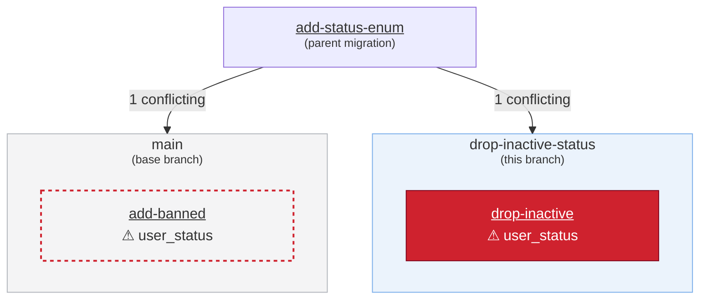

# Drizzle check action

Runs the drizzle-kit installed in your project (`drizzle-kit check --output json`) against the
checked-out repo and posts the result as a single sticky comment on the pull request. The comment
flips to green when migrations are commutative and shows a per-conflict report when they are not.
The step exits non-zero on conflicts, so CI goes red and the check can be marked as required.

## Usage

Add a step to a `pull_request`-triggered workflow that checks out the repo, installs your project's
dependencies (`pnpm` shown below; `npm`, `yarn`, and `bun` are also detected automatically), then
references this action. The package manager is auto-detected from the nearest lockfile at or above
`working-directory`.

```yaml
name: Drizzle check
on: pull_request

permissions:
  contents: read
  pull-requests: write

jobs:
  check:
    runs-on: ubuntu-latest
    steps:
      - uses: actions/checkout@v4

      - uses: pnpm/action-setup@v4
      - uses: actions/setup-node@v4
        with:
          node-version: 20
          cache: pnpm
      - run: pnpm install --frozen-lockfile

      - uses: drizzle-team/drizzle-orm/actions/check@main
```

## Custom config location

`drizzle.config.ts` at the repository root is used by default. If your config lives elsewhere or
has a different name, point the `config` input at it:

```yaml
      - uses: drizzle-team/drizzle-orm/actions/check@main
        with:
          config: config/drizzle.config.ts
```

## Monorepos

Run the check from the package that declares `drizzle-kit` by setting `working-directory`; the
`config` path is resolved relative to it:

```yaml
      - uses: drizzle-team/drizzle-orm/actions/check@main
        with:
          working-directory: packages/db
```

If `drizzle-kit` cannot be resolved in `working-directory` (for example, it is only installed in a
nested package), the action posts a setup-guidance comment and fails the step instead of running
the check.

## Inputs

| Input               | Description                                                                       | Default              |
| ------------------- | --------------------------------------------------------------------------------- | -------------------- |
| `config`            | Path to the drizzle config file, relative to `working-directory`.                 | `drizzle.config.ts`  |
| `working-directory` | Directory to run the check in (package manager detected from the nearest lockfile at or above it). | `.`                  |
| `github-token`      | Token used to post the sticky PR comment.                                         | `${{ github.token }}` |
| `diagram`           | Whether to include a Mermaid diagram of the conflict in the PR comment (`true`/`false`). | auto (see below)     |

## The conflict report

When conflicts are found, the comment shows the affected part of the migration history in two
forms: an optional Mermaid diagram and a text representation that is always present. The examples
below all show the same situation: the current branch adds `0005_drop-inactive` while the base
branch already gained `0005_add-banned`, both forked from `0004_add-status-enum` and both touching
the `user_status` enum.

### Diagram

A Mermaid flowchart showing the conflicting migrations grouped by branch. Conflicting migrations
are highlighted (solid for this branch's, outlined for ones already on the base branch) and
annotated with the objects they touch; fork parents sharing the same conflicts collapse into a
single node whose arrows point at the branch blocks. Migrations not involved in the conflict are
omitted. Where GitHub renders Mermaid interactively (github.com and GitHub Enterprise Cloud),
every migration name links to its folder at the checked commit.

The diagram is controlled by the `diagram` input. When the input is not set, it is included where
GitHub renders Mermaid — github.com, GitHub Enterprise Cloud, and GitHub Enterprise Server 3.7+ —
and omitted on older GitHub Enterprise Server instances or when the server version cannot be
determined. Set `diagram: true` or `diagram: false` to skip the detection and force it on or off.



*Solid red: conflicting migrations from this branch. Outlined red: conflicting migrations already
on `main`.*

### Text representation

A nested, marker-less rendering of the conflict, always present below the diagram (and standalone
when the diagram is off); every migration links to its folder at the checked commit. The markers
mirror the diagram: 🔴 conflicting migration from this branch, ⭕ conflicting migration already on
the base branch:

<dl><dd>🔀 <code>drizzle/0004_add-status-enum</code> <em>(fork point)</em></dd><dd><dl><dd>🔴 <code>drizzle/0005_drop-inactive</code> <em>(this branch)</em> — recreates enum <code>user_status</code> in schema <code>public</code></dd><dd>⭕ <code>drizzle/0005_add-banned</code> <em>(from <code>main</code>)</em> — alters enum <code>user_status</code> in schema <code>public</code></dd></dl></dd></dl>

## Permissions

The job needs `pull-requests: write` so the action can create and update the sticky comment.
The step exits non-zero when conflicts are detected, so it can be made a required check.

## Branch protection

The check runs on `pull_request` events, so it only sees the base branch as it was when the PR was
last pushed. If another PR with a conflicting migration merges first, the existing green check (and
comment) become stale — nothing re-runs them, and the conflict would only surface after both PRs
land. Re-running the workflow manually does not help either: a re-run reuses the merge commit from
the original event.

To close this gap, protect the base branch with both:

- the `check` job marked as a **required status check**, and
- **"Require branches to be up to date before merging"** enabled.

GitHub then forces the PR branch to be updated with the latest base before merging, which fires a
`synchronize` event and re-runs the check against the real merge result — conflicting migrations
flip the comment to red and block the merge instead of slipping through.
